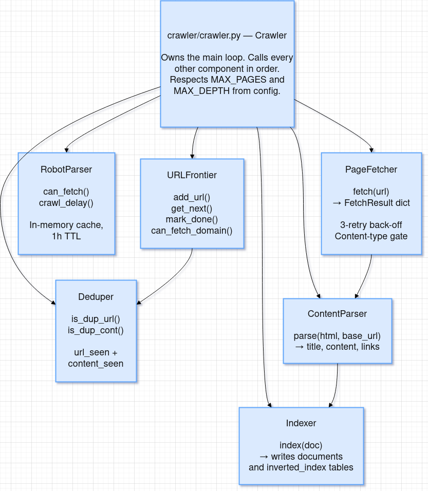
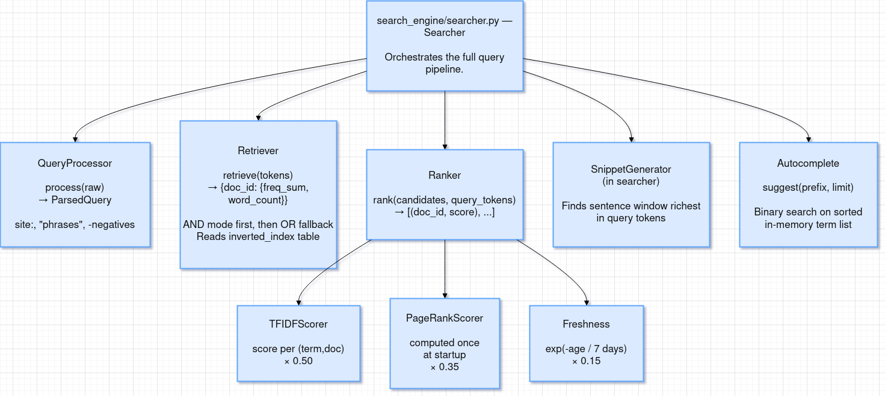
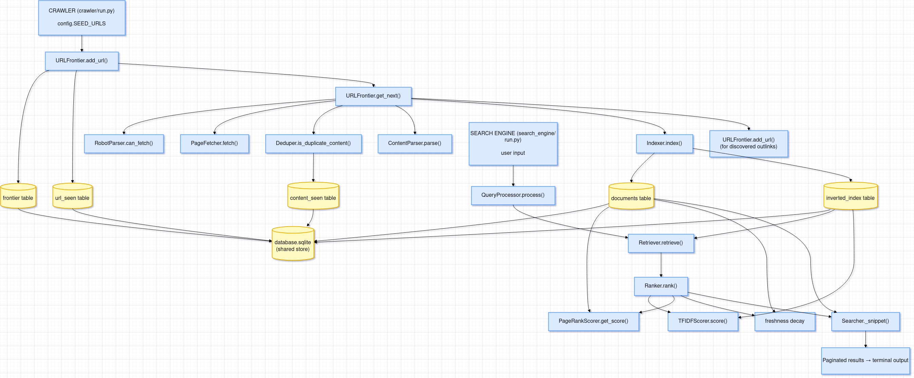

# Architecture

## Directory Structure

```
project/
├── crawler/                    ← Program 1: web crawler + indexer
│   ├── __init__.py
│   ├── config.py               ← All tunable parameters (edit before running)
│   ├── db.py                   ← SQLite bootstrap and connection factory
│   ├── url_frontier.py         ← Priority queue backed by the frontier table
│   ├── fetcher.py              ← HTTP client (requests, retry, size cap)
│   ├── robot_parser.py         ← robots.txt fetcher and per-domain cache
│   ├── parser.py               ← HTML → title + body text + outlinks
│   ├── deduplicator.py         ← URL-level and content-level dedup
│   ├── tokenizer.py            ← Lowercase → stop-word removal → Porter stem
│   ├── indexer.py              ← TF/position computation + SQLite writes
│   ├── crawler.py              ← Main crawl loop orchestrator
│   └── run.py                  ← CLI entry point
│
├── database.sqlite             ← Shared store (auto-created on first crawl)
│
├── search_engine/              ← Program 2: interactive search REPL
│   ├── __init__.py
│   ├── db.py                   ← Read-only connection to database.sqlite
│   ├── tokenizer.py            ← Identical pipeline to crawler/tokenizer.py
│   ├── query_processor.py      ← Parses site:, quotes, -negatives
│   ├── retriever.py            ← AND/OR posting-list lookup
│   ├── tfidf.py                ← Per-document TF-IDF scoring
│   ├── pagerank.py             ← Iterative PageRank over the link graph
│   ├── ranker.py               ← Blends TF-IDF + PageRank + Freshness
│   ├── autocomplete.py         ← Prefix lookup via binary search
│   ├── searcher.py             ← Full search pipeline orchestrator
│   └── run.py                  ← Interactive REPL entry point
│
├── requirements.txt
├── README.md
├── System_design.md
├── Architecture.md             ← this file
└── usage_guide.md
```

---

## Component Map

### Crawler Components



### Search Engine Components



---

## Database Schema

All tables live in `database.sqlite` at the project root. Both programs open the file with `PRAGMA journal_mode=WAL` so they can operate concurrently without blocking.

### `frontier`
Crawl queue. Persists across restarts.

| Column | Type | Description |
|---|---|---|
| `id` | INTEGER PK | Auto-increment row ID |
| `url` | TEXT UNIQUE | The URL to crawl |
| `priority` | INTEGER | Lower = higher priority. Seeds = 0, discovered links = depth |
| `status` | TEXT | `pending` → `processing` → `crawled` / `failed` |
| `domain` | TEXT | `urlparse(url).netloc` — used for rate limiting |
| `depth` | INTEGER | Hop count from the seed URL |
| `added_at` | REAL | Unix timestamp when added |

### `domain_access`
Per-domain rate-limiting timestamps.

| Column | Type | Description |
|---|---|---|
| `domain` | TEXT PK | e.g. `en.wikipedia.org` |
| `last_access` | REAL | Unix timestamp of last successful fetch |

### `url_seen`
URL deduplication fingerprints. Never pruned.

| Column | Type | Description |
|---|---|---|
| `url_hash` | TEXT PK | SHA-256 of the normalised URL |
| `url` | TEXT | Original URL (for debugging) |

### `content_seen`
Content deduplication fingerprints. Never pruned.

| Column | Type | Description |
|---|---|---|
| `content_hash` | TEXT PK | SHA-256 of the raw HTML body |

### `documents`
Forward index — one row per crawled page.

| Column | Type | Description |
|---|---|---|
| `doc_id` | INTEGER PK | Auto-increment document ID |
| `url` | TEXT UNIQUE | Final URL (after redirects) |
| `title` | TEXT | `<title>` tag or first `<h1>` |
| `content` | TEXT | Cleaned visible body text (noise tags stripped) |
| `description` | TEXT | `<meta name="description">` content |
| `word_count` | INTEGER | Token count after stop-word removal |
| `last_crawled` | REAL | Unix timestamp of the fetch |
| `links` | TEXT | JSON array of normalised outbound URLs |

### `inverted_index`
Core search index — one row per (term, document) pair.

| Column | Type | Description |
|---|---|---|
| `term` | TEXT | Stemmed, lowercase token |
| `doc_id` | INTEGER | References `documents.doc_id` |
| `frequency` | INTEGER | Number of times this term appears in this document |
| `positions` | TEXT | JSON array of token offsets (e.g. `[4, 17, 203]`) |

Primary key: `(term, doc_id)`. Index on `term` for O(log N) posting-list lookup.

---

## Class Reference

### `crawler/url_frontier.py` — `URLFrontier`

| Method | Signature | Description |
|---|---|---|
| `add_url` | `(url, depth, priority) → bool` | Adds URL to frontier. Returns `False` if already seen. |
| `get_next` | `() → dict \| None` | Pops the highest-priority pending URL. Sets status to `processing`. |
| `mark_done` | `(url, status)` | Updates status to `crawled` or `failed`. |
| `can_fetch_domain` | `(domain, min_interval) → bool` | True if enough time has elapsed since last fetch. |
| `update_domain_access` | `(domain)` | Writes current timestamp to `domain_access` table. |
| `pending_count` | `() → int` | Count of URLs with status `pending`. |

### `crawler/fetcher.py` — `PageFetcher`

| Method | Signature | Description |
|---|---|---|
| `fetch` | `(url, max_retries=3) → dict \| None` | Downloads URL. Returns `None` for non-HTML or on all retries exhausted. Result dict has keys: `url`, `status_code`, `content`, `content_type`. |

### `crawler/parser.py` — `ContentParser`

| Method | Signature | Description |
|---|---|---|
| `parse` | `(html, base_url) → dict` | Returns `{title, description, content, links}`. Noise tags removed before text extraction. |

### `crawler/deduplicator.py` — `Deduper`

| Method | Signature | Description |
|---|---|---|
| `is_duplicate_url` | `(url) → bool` | Checks in-memory cache backed by `url_seen` table. |
| `is_duplicate_content` | `(content) → bool` | SHA-256 lookup in `content_seen` table. |
| `add_url` | `(url)` | Marks URL as seen in cache and database. |
| `add_content` | `(content)` | Marks content hash as seen. |

### `crawler/indexer.py` — `Indexer`

| Method | Signature | Description |
|---|---|---|
| `index` | `(doc: dict) → int` | Tokenises content, computes TF+positions, upserts to `documents` and `inverted_index`. Returns `doc_id`. |

### `crawler/tokenizer.py` — `Tokenizer`

| Method | Signature | Description |
|---|---|---|
| `tokenize` | `(text: str) → list[str]` | Full pipeline: lowercase → regex extract → stop-word filter → Porter stem. |

### `search_engine/query_processor.py` — `QueryProcessor`

| Method | Signature | Description |
|---|---|---|
| `process` | `(raw: str) → ParsedQuery` | Returns a `ParsedQuery` dataclass with `tokens`, `must_not`, `site_filter`, `phrases`, `raw`. |

### `search_engine/retriever.py` — `Retriever`

| Method | Signature | Description |
|---|---|---|
| `retrieve` | `(tokens: list) → dict` | Returns `{doc_id: {freq_sum, word_count}}`. Tries AND first, falls back to OR. |

### `search_engine/ranker.py` — `Ranker`

| Method | Signature | Description |
|---|---|---|
| `rank` | `(candidates, query_tokens) → list[tuple]` | Returns `[(doc_id, score)]` sorted descending. Triggers PageRank computation on first call. |

### `search_engine/searcher.py` — `Searcher`

| Method | Signature | Description |
|---|---|---|
| `search` | `(raw_query, page=0, page_size=10) → dict` | Full pipeline. Returns `{query, total_results, page, page_size, results}`. Each result has `doc_id`, `url`, `title`, `snippet`, `score`. |

### `search_engine/autocomplete.py` — `Autocomplete`

| Method | Signature | Description |
|---|---|---|
| `suggest` | `(prefix, limit=5) → list[str]` | Binary search on sorted in-memory term list. `O(log N)` per call. |
| `reload` | `()` | Clears in-memory cache. Call after new documents are indexed. |

---

## Configuration Reference (`crawler/config.py`)

| Parameter | Default | Description |
|---|---|---|
| `SEED_URLS` | `["https://example.com", ...]` | Starting URLs for the crawl. |
| `MAX_PAGES` | `100` | Hard cap on pages crawled per run. |
| `MAX_DEPTH` | `3` | Maximum link hops from any seed URL. |
| `RATE_LIMIT_SECONDS` | `1.5` | Minimum seconds between requests to the same domain. |
| `RESPECT_ROBOTS_TXT` | `True` | Honour `robots.txt` Disallow rules. |
| `REQUEST_TIMEOUT` | `15` | Per-request timeout in seconds. |
| `USER_AGENT` | `"PythonSearchBot/1.0 ..."` | HTTP User-Agent header sent with every request. |
| `MAX_CONTENT_BYTES` | `2097152` | Skip pages larger than this (2 MB default). |
| `USE_STEMMING` | `True` | Apply Porter stemming. Must match between crawler and search engine. |

---

## Data Flow Diagram



---

## Dependency Graph

The two programs share no Python imports. Each is self-contained. Their only shared resource is `database.sqlite`.

```
crawler/run.py
 └─ crawler.py
     ├─ config.py              (no imports from project)
     ├─ db.py                  (no imports from project)
     ├─ url_frontier.py   ──►  db.py
     ├─ fetcher.py        ──►  config.py
     ├─ robot_parser.py   ──►  config.py
     ├─ parser.py              (no project imports)
     ├─ deduplicator.py   ──►  db.py
     ├─ tokenizer.py      ──►  config.py
     └─ indexer.py        ──►  db.py, tokenizer.py

search_engine/run.py
 └─ searcher.py
     ├─ db.py                  (no imports from project)
     ├─ tokenizer.py           (no project imports)
     ├─ query_processor.py ──► tokenizer.py
     ├─ retriever.py       ──► db.py
     ├─ tfidf.py           ──► db.py
     ├─ pagerank.py        ──► db.py
     ├─ ranker.py          ──► db.py, tfidf.py, pagerank.py
     └─ autocomplete.py    ──► db.py
```

---

## External Dependencies

| Package | Version | Used by | Purpose |
|---|---|---|---|
| `requests` | ≥ 2.31 | `crawler/fetcher.py` | HTTP client for page downloads |
| `beautifulsoup4` | ≥ 4.12 | `crawler/parser.py` | HTML parsing and text extraction |
| `lxml` | ≥ 4.9 | `crawler/parser.py` | Fast HTML parser backend for BeautifulSoup |

All other components use Python standard library only: `sqlite3`, `hashlib`, `re`, `json`, `time`, `urllib`, `argparse`, `logging`, `bisect`, `math`, `collections`.

No NLTK downloads are required. The tokeniser uses a built-in stop-word list and a pure-Python Porter stemmer implementation.
