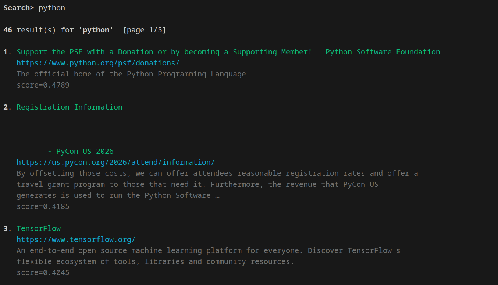
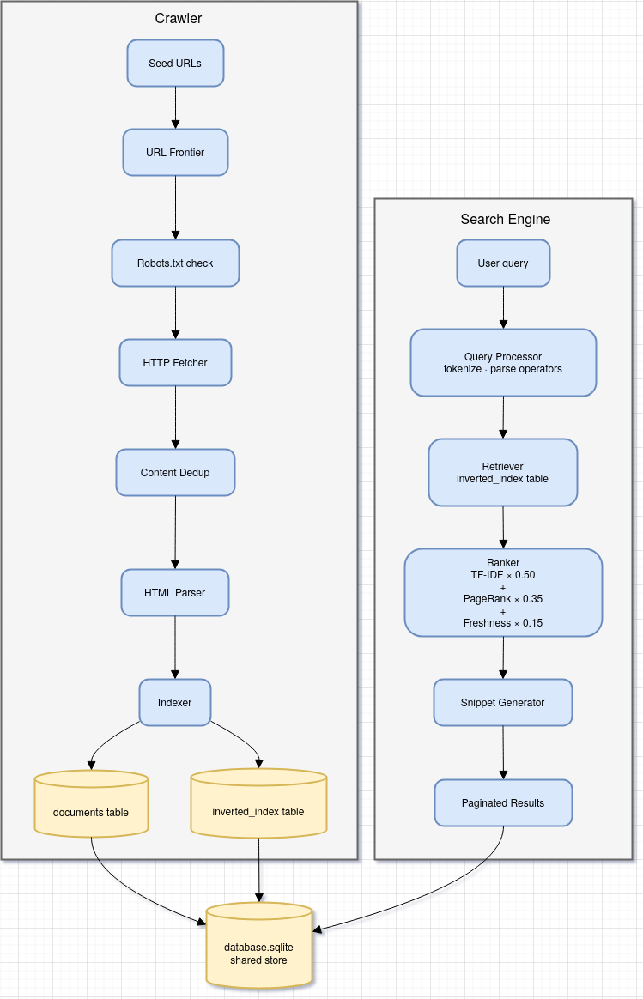

# Python Search Engine

A two-program web search system written entirely in Python, using **SQLite** as the only external dependency (no Redis, no Elasticsearch).

```
project/
├── crawler/              ← Program 1: crawls the web and builds the index
│   ├── config.py         ← ✏️  Edit seed URLs and limits here
│   ├── crawler.py
│   ├── url_frontier.py
│   ├── fetcher.py
│   ├── parser.py
│   ├── robot_parser.py
│   ├── deduplicator.py
│   ├── tokenizer.py
│   ├── indexer.py
│   ├── db.py
│   └── run.py            ← Entry point
├── database.sqlite       ← Shared database (auto-created by crawler)
├── search_engine/        ← Program 2: interactive search REPL
│   ├── db.py
│   ├── tokenizer.py
│   ├── retriever.py
│   ├── tfidf.py
│   ├── pagerank.py
│   ├── ranker.py
│   ├── query_processor.py
│   ├── autocomplete.py
│   ├── searcher.py
│   └── run.py            ← Entry point
└── requirements.txt
```

---

## Output


## Prerequisites

Python 3.11 or newer is required.

```bash
# 1. Create a virtual environment (recommended)
python -m venv .venv
source .venv/bin/activate        # Windows: .venv\Scripts\activate

# 2. Install dependencies
pip install -r requirements.txt
```

---

## Step 1 — Configure the Crawler

Open **`crawler/config.py`** and set your starting URLs and limits:

```python
SEED_URLS = [
    "https://example.com",
    "https://en.wikipedia.org/wiki/Web_crawler",
]
MAX_PAGES = 100    # How many pages to crawl total
MAX_DEPTH = 3      # Maximum link hops from a seed
```

---

## Step 2 — Run the Crawler

Run from the **project root** (the folder containing both `crawler/` and `search_engine/`):

```bash
python crawler/run.py
```

**Options:**

```bash
# Override seed URLs on the command line
python crawler/run.py --seeds https://python.org https://docs.python.org

# Override max pages
python crawler/run.py --max 50

# Both at once
python crawler/run.py --seeds https://example.com --max 200
```

**What you will see:**

```
============================================================
  PythonSearchBot — Web Crawler
============================================================
  Seed URLs : ['https://example.com', ...]
  Max pages : 100
  Max depth : 3
  Rate limit: 1.5s per domain
  Robots.txt: respected
============================================================

[DB] Database ready → /path/to/project/database.sqlite
10:01:23 [INFO] Seeded 2 new URL(s). Max pages: 100
10:01:23 [INFO] [1/100] https://example.com
10:01:25 [INFO]   ✓ doc_id=1  title='Example Domain'
10:01:25 [INFO]     found 1 links
...

Crawl finished — crawled: 47, indexed: 47, skipped: 3
```

**Resuming a crawl:** The frontier is persisted in `database.sqlite`. Simply run the same command again and it will pick up where it left off.

**Stopping mid-crawl:** Press `Ctrl+C`. Progress is automatically saved.

---

## Step 3 — Run the Search Engine

After crawling, start the interactive search REPL:

```bash
python search_engine/run.py
```

**What you will see:**

```
──────────────────────────────────────────────────────────────────────
  🔍  PythonSearchEngine
  Database: /path/to/project/database.sqlite
──────────────────────────────────────────────────────────────────────
  Type a query to search. Type :help for commands.

  Search> _
```

---

## Search Syntax

| Input | Meaning |
|---|---|
| `web crawler python` | Keyword search (all terms) |
| `"web crawler"` | Phrase must appear |
| `python -snake` | Exclude 'snake' |
| `site:docs.python.org async` | Restrict to domain |
| `python --page 2` | Go to page 2 of results |

## REPL Commands

| Command | Action |
|---|---|
| `:help` | Show syntax help |
| `:stats` | Show database statistics |
| `:suggest web` | Autocomplete suggestions for prefix |
| `:quit` | Exit |

---

## Architecture





### Ranking Formula

```
score = 0.50 × TF-IDF
      + 0.35 × PageRank
      + 0.15 × Freshness
```

- **TF-IDF**: term frequency × inverse document frequency — how relevant the page is to your query.
- **PageRank**: iterative link-graph score — how authoritative the page is.
- **Freshness**: exponential decay (half-life 7 days) — newer pages score slightly higher.

---

## Troubleshooting

| Problem | Fix |
|---|---|
| `database.sqlite not found` | Run the crawler first: `python crawler/run.py` |
| `No results` | Try a simpler query; check `:stats` to confirm pages were indexed |
| Crawler blocked by site | Normal — robots.txt is respected. Try different seeds. |
| NLTK download error | Run `python -c "import nltk; nltk.download('all')"` |
