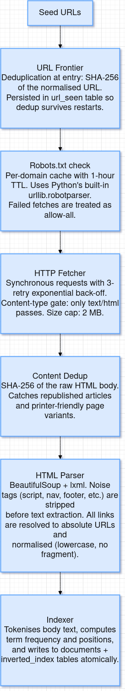
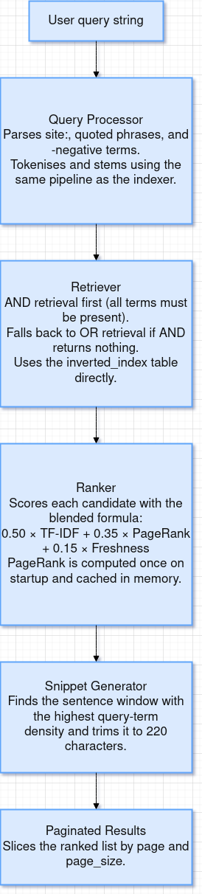

# System Design

## Overview

This project is a two-program, self-contained web search system written entirely in Python. It is split into two independent programs — a **web crawler** and a **search engine** — that communicate exclusively through a shared SQLite database file (`database.sqlite`). There are no message queues, no network services, and no third-party search infrastructure required to run the system.

The design is deliberately simple: you run the crawler until you have enough pages, then run the search engine to query them. Both programs can run on the same machine with no configuration beyond editing a single config file.

---

## Goals and Non-Goals

**Goals**

- Crawl real websites starting from a configurable set of seed URLs
- Build a searchable inverted index from the crawled content
- Rank results using a combination of TF-IDF relevance, PageRank authority, and document freshness
- Support advanced query syntax: phrases, negative terms, site filters, and pagination
- Run entirely offline once seeded, with no cloud dependencies
- Resume a crawl that was interrupted without losing progress

**Non-Goals**

- Crawling at web-scale (millions of domains, billions of pages)
- Real-time indexing (index is built during the crawl, not at query time on demand)
- JavaScript rendering (only static HTML is fetched and parsed)
- Distributed operation across multiple machines
- A graphical user interface

---

## The Two-Program Architecture

The single most important design decision is the split into two separate programs.

Most beginner search projects couple the crawler and search engine in the same process. This creates a problematic dependency: you cannot search until the crawl is done, and you cannot crawl without loading all the search infrastructure. This project separates the two into:

```
crawler/run.py          →  writes to database.sqlite
search_engine/run.py    →  reads from database.sqlite
```

This separation means:

- You can run the crawler overnight and search the next morning without restarting anything.
- The crawler can be re-run to add more pages without touching the search engine.
- The search engine starts in under a second because it does not need to rebuild any state.
- Both programs can be reasoned about independently. A bug in the ranker does not affect the crawl loop.

The shared database acts as the contract between the two programs. The crawler is the writer; the search engine is the reader. This is the same pattern used by large-scale systems like Nutch + Solr or Scrapy + Elasticsearch, just without the network layer.

---

## Data Flow

### Crawler Pipeline

Each URL goes through seven sequential stages before its content reaches the database:



### Search Pipeline

A query goes through five stages from raw string to ranked results:



---

## Storage Design

The entire system uses a single SQLite file at the project root. SQLite was chosen over Redis, PostgreSQL, or Elasticsearch for three reasons:

1. Zero infrastructure — no server to start, no port to open, no credentials to manage.
2. File portability — the entire index is a single file you can copy, back up, or delete.
3. Sufficient performance — for a single-machine search engine indexing up to ~100,000 pages, SQLite with WAL mode handles query loads well.

### Tables

**`frontier`** — The crawl queue. Each row is a URL with a priority, status, and depth. The `status` column (`pending` → `processing` → `crawled`/`failed`) acts as a distributed lock so a crawl can be safely interrupted and resumed.

**`url_seen`** — SHA-256 fingerprints of every URL ever added to the frontier. This is the authoritative URL deduplication store. Kept separate from `frontier` so the dedup check remains fast even when the frontier is pruned.

**`content_seen`** — SHA-256 fingerprints of raw HTML bodies. Catches duplicate content that appears at different URLs (syndicated articles, redirect mirrors, etc.).

**`domain_access`** — One row per domain, storing the Unix timestamp of the last fetch. Used by the politeness system to enforce the rate-limit delay.

**`documents`** — The forward index. One row per crawled page, storing URL, title, meta description, cleaned body text, word count, crawl timestamp, and a JSON array of outbound links. The body text is stored here to support snippet generation without re-fetching.

**`inverted_index`** — The core search index. One row per (term, document) pair, storing the term frequency and a JSON array of token positions within the document. Queried by term, so `CREATE INDEX idx_ii_term ON inverted_index (term)` is critical for query performance.

### WAL Mode

Both programs open the database with `PRAGMA journal_mode=WAL`. Write-Ahead Logging allows the crawler (writer) and the search engine (reader) to operate on the database simultaneously without blocking each other. Without WAL, a long crawler write would cause the search engine to wait.

---

## Deduplication Strategy

Duplicate content is one of the biggest quality problems in a web crawler. This system uses two complementary checks:

**URL-level deduplication** happens before any HTTP request is made. The URL is normalised (lowercase scheme and host, no fragment, sorted query parameters) and SHA-256 hashed. The hash is stored in `url_seen`. If the hash already exists, the URL is silently dropped.

**Content-level deduplication** happens after the page is fetched but before it is parsed and indexed. The raw HTML is SHA-256 hashed. If the hash already exists in `content_seen`, the page is skipped. This catches:
- Printer-friendly versions of pages (`/print/article-123`)
- HTTP vs HTTPS duplicates that survive URL normalisation
- Republished syndicated content

The project's original codebase also references SimHash for near-duplicate detection (pages that are 95% identical but not byte-for-byte identical). This is not implemented in the current version but the `deduplicator.py` module is the correct place to add it.

---

## Politeness System

The crawler enforces two independent constraints before fetching any URL:

**Robots.txt** — The `RobotParser` class fetches and parses `/robots.txt` for every domain on first visit and caches the result for one hour. If the user-agent is disallowed for a URL, it is marked as `failed` in the frontier and skipped. If `robots.txt` cannot be fetched (network error, 404), all URLs on that domain are allowed. If it returns 401 or 403, all URLs are disallowed.

**Rate limiting** — The `domain_access` table records the last fetch timestamp per domain. Before fetching, the crawler checks that at least `RATE_LIMIT_SECONDS` (default 1.5) have elapsed since the last request to the same domain. If the domain's `Crawl-Delay` directive in `robots.txt` is longer than `RATE_LIMIT_SECONDS`, the larger value is used.

---

## Ranking Model

Results are scored by a weighted linear combination of three signals:

```
score = 0.50 × TF-IDF  +  0.35 × PageRank  +  0.15 × Freshness
```

**TF-IDF** is the primary relevance signal. It rewards pages where the query terms appear frequently relative to the document's length, and penalises terms that appear in most documents (low discriminating power). The formula used is:

```
TF-IDF(term, doc) = (freq / word_count) × ( log((N+1)/(df+1)) + 1 )
```

where `N` is total documents and `df` is the number of documents containing the term.

**PageRank** is the authority signal. It is computed once when the search engine starts, using the link graph stored in `documents.links`. The iterative power-method converges in ~20 iterations for typical crawls. Scores are normalised to [0, 1] before blending. Pages with no inlinks get a score of 0.

**Freshness** is an exponential decay over crawl age:

```
freshness = exp( -age_in_seconds / half_life )
```

The half-life is set to 7 days. A page crawled today scores 1.0; a page crawled 7 days ago scores 0.5; a page crawled 14 days ago scores 0.25. This gently favours recently crawled content without completely burying older pages.

The weights (0.50 / 0.35 / 0.15) follow the conventions of the source project this was derived from. They can be adjusted in `search_engine/ranker.py`.

---

## Tokenisation Pipeline

The tokeniser is the most critical shared component because it must produce **identical output** in both the crawler (at index time) and the search engine (at query time). A mismatch would cause indexed terms to never match query terms.

The pipeline is:

1. Lowercase all text
2. Extract tokens matching `\b[a-z][a-z0-9]*\b` (alpha-leading, alphanumeric)
3. Remove stop words (built-in list of ~200 common English words plus web noise: `http`, `https`, `www`, `com`, etc.)
4. Remove tokens shorter than 3 characters
5. Apply Porter stemming (steps 1–3 of the classic algorithm, implemented in pure Python with no NLTK download required)

The tokeniser is duplicated in `crawler/tokenizer.py` and `search_engine/tokenizer.py`. This is intentional — it keeps both programs fully self-contained with no cross-package imports. Any change to the tokeniser must be applied to both files simultaneously, and the index must be rebuilt.

---

## Resumability

The crawler is designed to be safely interrupted at any point and resumed without data loss:

- The `frontier` table preserves all pending URLs across restarts.
- URLs in `processing` status (fetched but interrupted before indexing) are not re-queued automatically. A short `UPDATE frontier SET status='pending' WHERE status='processing'` query can reset them if needed.
- Content already in `documents` and `inverted_index` is preserved. Re-running the crawler on already-indexed URLs performs an upsert (ON CONFLICT DO UPDATE) rather than a duplicate insert.
- The `url_seen` and `content_seen` tables prevent re-fetching the same content even across separate crawl runs.

---

## Known Limitations

**No JavaScript rendering.** The fetcher uses `requests`, which only retrieves the raw HTTP response. Modern single-page applications built with React, Vue, or Angular deliver an empty `<div>` on first load. The crawler would index essentially nothing from these sites. Fixing this requires replacing the fetcher with a headless browser (Playwright or Selenium).

**Single-threaded crawler.** The crawler processes one URL at a time. A typical crawl of 100 pages takes 2–5 minutes depending on site latency. To crawl thousands of pages efficiently, the fetcher should be replaced with an async implementation using `aiohttp` and `asyncio`.

**SQLite write contention at scale.** SQLite with WAL mode handles concurrent reads well but serialises writes. Above ~50,000 documents, the inverted index updates become the bottleneck. For larger corpora, the inverted index should be migrated to Elasticsearch or a custom binary format.

**PageRank computed on startup.** The `PageRankScorer.ensure_computed()` call in `Ranker.__init__` computes PageRank synchronously when the search engine starts. For crawls larger than ~10,000 documents this adds a noticeable startup delay. The fix is to pre-compute PageRank as a separate offline step and store the scores back in the `documents` table.

**English only.** The stop-word list and tokeniser are tuned for English. Non-English pages will be indexed with lower quality (stop words not removed, no language-appropriate stemming).
